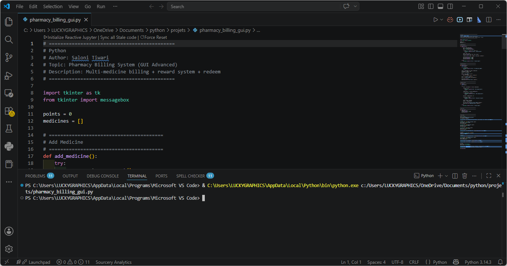
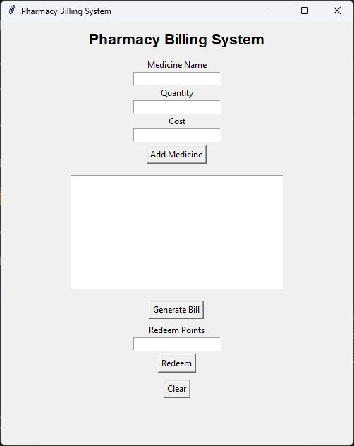

# 💊 Pharmacy Billing System


A beginner-friendly Python project that simulates a real-world pharmacy billing system.  
This project includes both a Command Line Interface (CLI) version and a Graphical User Interface (GUI) version using Tkinter.

---

# 📚 Project Overview

This project is designed to practice Python programming by building a real-world billing system used in medical stores.

The system can:

- Calculate medicine bills
- Track customer loyalty points
- Redeem loyalty points
- Handle multiple customer visits
- Maintain cart-based billing
- Generate final bills automatically

The project focuses on improving:
- Python fundamentals
- Problem solving
- GUI development
- Logic building
- Billing system workflow understanding

---

# ✨ Features

## ✅ Billing Features

- Multiple medicine entries
- Automatic bill calculation
- Quantity-based pricing
- Final bill generation
- Customer visit tracking

## ✅ Loyalty Points System

- Earn points on purchases
- Redeem points for discounts
- Carry forward points between visits

## ✅ CLI Version

- Terminal-based interaction
- Lightweight execution
- Simple input/output handling

## ✅ GUI Version

- Tkinter graphical interface
- Interactive buttons
- Cart management
- User-friendly billing workflow

---

# 🎯 Loyalty Points Logic

- ₹100 bill = 1 loyalty point

### Example

```text
₹560 bill = 560 // 100 = 5 points
```

---

# 🎁 Redemption Rules

- 1 point = ₹25 discount
- Minimum 10 points required for redemption
- Cannot redeem more points than available
- Cannot redeem more discount than bill amount

---

# 🛠️ How to Run

## Clone Repository

```bash
git clone https://github.com/25f2005869-glitch/pharmacy-billing-system.git
```

---

## Move into Project Folder

```bash
cd pharmacy-billing-system
```

---

# 💻 Run CLI Version

```bash
python pharmacy_billing_system.py
```

---

# 🖥️ Run GUI Version

```bash
python pharmacy_billing_gui.py
```

---

# 📂 Project Structure

```text
pharmacy-billing-system/
│
├── pharmacy_billing_system.py
├── pharmacy_billing_gui.py
├── pharmacy_billing_system.png
├── pharmacy_billing_terminal.png
└── README.md
```

---

# 🖼️ Project Screenshots

## 💻 CLI Version



---

## 🖥️ GUI Version



---

# ⚙️ GUI Workflow

## Add Medicine
Adds medicines and quantities to the cart.

## Generate Bill
Calculates total bill and earned loyalty points.

## Redeem Points
Applies discount using earned points.

## Clear Cart
Removes all cart items.

## New Visit
Starts a new customer session while keeping loyalty points.

---

# 📈 Skills Practiced

- Python Programming
- Tkinter GUI Development
- Conditional Logic
- Functions
- Loops
- Billing Logic
- Cart Management
- Data Handling
- Problem Solving
- User Interaction Design

---

# 🧠 Concepts Used

- Functions
- Lists
- Dictionaries
- Conditional Statements
- Loops
- Input Validation
- GUI Widgets
- Event Handling
- Modular Programming

---

# 🚀 Future Improvements

Planned future updates:

- Database integration
- Invoice generation
- Customer history tracking
- Medicine inventory management
- Search functionality
- Login authentication
- PDF bill export
- Dark mode GUI
- Data analytics dashboard

---

# 🧰 Technologies Used

- Python 3
- Tkinter
- VS Code
- Git
- GitHub

---

# 👨‍💻 Author

Saloni Tiwari  
Python & Data Science Student

---

# 🙏 Acknowledgement

This project is part of my continuous programming learning journey focused on building practical Python applications through real-world problem solving and structured development practice.

---

⭐ If you like this project, feel free to star the repository!
